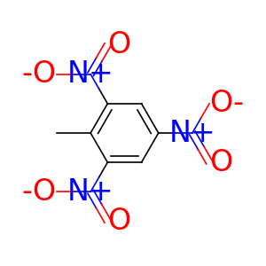
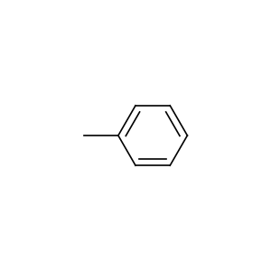

torchdrug.data
==============

Data Structures
---------------

.. currentmodule:: torchdrug.data

Graph
^^^^^
.. autoclass:: Graph
    :members:

Molecule
^^^^^^^^
.. autoclass:: Molecule
    :members:

Protein
^^^^^^^
.. autoclass:: Protein
    :members:

PackedGraph
^^^^^^^^^^^
.. autoclass:: PackedGraph
    :members:

PackedMolecule
^^^^^^^^^^^^^^
.. autoclass:: PackedMolecule
    :members:

PackedProtein
^^^^^^^^^^^^^
.. autoclass:: PackedProtein
    :members:

Dictionary
^^^^^^^^^^
.. autoclass:: Dictionary
    :members:

Datasets
--------
.. currentmodule:: torchdrug.data

KnowledgeGraphDataset
^^^^^^^^^^^^^^^^^^^^^
.. autoclass:: KnowledgeGraphDataset
    :members:

MoleculeDataset
^^^^^^^^^^^^^^^
.. autoclass:: MoleculeDataset
    :members:

ProteinDataset
^^^^^^^^^^^^^^
.. autoclass:: ProteinDataset
    :members:

ProteinPairDataset
^^^^^^^^^^^^^^^^^^
.. autoclass:: ProteinPairDataset
    :members:

ProteinLigandDataset
^^^^^^^^^^^^^^^^^^^^
.. autoclass:: ProteinLigandDataset
    :members:

NodeClassificationDataset
^^^^^^^^^^^^^^^^^^^^^^^^^
.. autoclass:: NodeClassificationDataset
    :members:

ReactionDataset
^^^^^^^^^^^^^^^
.. autoclass:: ReactionDataset
    :members:

SemiSupervised
^^^^^^^^^^^^^^
.. autoclass:: SemiSupervised
    :members:

Data Processing
---------------

DataLoader
^^^^^^^^^^
.. autoclass:: DataLoader
    :members:

Dataset Split Methods
^^^^^^^^^^^^^^^^^^^^^
.. autofunction:: graph_collate

.. autofunction:: key_split

.. autofunction:: ordered_scaffold_split

.. autofunction:: scaffold_split

.. autofunction:: semisupervised

Feature Functions
-----------------

.. currentmodule:: torchdrug.data.feature

Atom Features
^^^^^^^^^^^^^
.. autofunction:: atom_default

.. autofunction:: atom_symbol

.. autofunction:: atom_position

.. autofunction:: atom_property_prediction

.. autofunction:: atom_explicit_property_prediction

.. autofunction:: atom_pretrain

.. autofunction:: atom_center_identification

.. autofunction:: atom_synthon_completion

.. autofunction:: atom_residue_symbol

Bond Features
^^^^^^^^^^^^^
.. autofunction:: bond_default

.. autofunction:: bond_length

.. autofunction:: bond_property_prediction

.. autofunction:: bond_pretrain

Residue Features
^^^^^^^^^^^^^^^^
.. autofunction:: residue_default

.. autofunction:: residue_symbol

Molecule Features
^^^^^^^^^^^^^^^^^
.. autofunction:: molecule_default

.. autofunction:: ExtendedConnectivityFingerprint

.. function:: ECFP

    alias of ``torchdrug.data.feature.ExtendedConnectivityFingerprint``

Element Constants
-----------------

Element constants are provided for convenient manipulation of atom types. The atomic
numbers can be accessed by uppercased element names at the root of the package. For
example, we can get the carbon scaffold of a molecule with the following code.

.. code:: python

    import torchdrug as td
    from torchdrug import data

    smiles = "CC1=C(C=C(C=C1[N+](=O)[O-])[N+](=O)[O-])[N+](=O)[O-]"
    mol = data.Molecule.from_smiles(smiles)
    scaffold = mol.subgraph(mol.atom_type == td.CARBON)
    mol.visualize()
    scaffold.visualize()

There are also 2 constant arrays that map atomic numbers to element names.
``td.ATOM_NAME[i]`` returns the full name, while ``td.ATOM_SYMBOL[i]`` returns the
abbreviated chemical symbol for atomic number ``i``.

For a full list of elements, please refer to `the perodic table`_.

.. _the perodic table:
    https://en.wikipedia.org/wiki/Periodic_table
