Molecule Property Prediction
============================

.. include:: ../bibliography.rst

This page contains benchmarks of popular property prediction models.

We consider both vanilla random split and scaffold-based random split for molecule
datasets. The split for train/validation/test sets is 80%:10%:10%. For each model, we
evaluate it with 5 random splits and report the mean and the deviation of the
performance. We report MAE and R2 metrics for regression datasets, AUROC and AURPC
metrics for binary classification datasets.

For datasets containing a lot of tasks, only the first 16 tasks are showed here due
to space limitations.

Random Split
------------

QM9
^^^

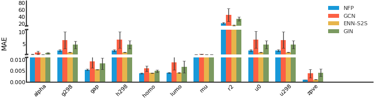
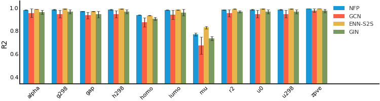

QM8
^^^

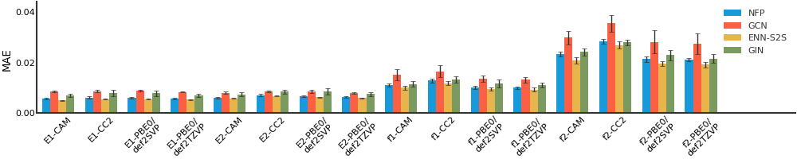
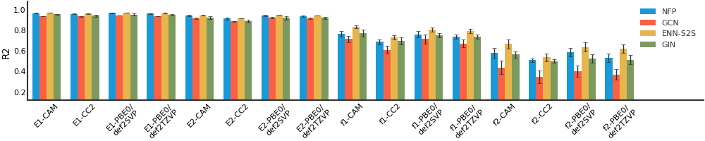

BACE
^^^^

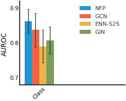
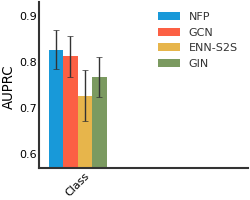

BBBP
^^^^

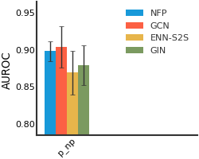
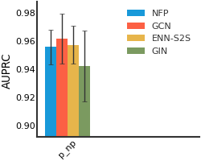

CEP
^^^

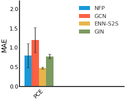
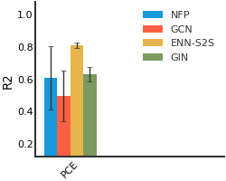

HIV
^^^

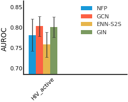
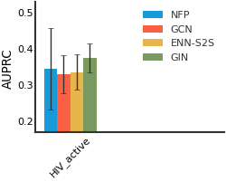

ClinTox
^^^^^^^

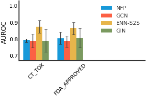
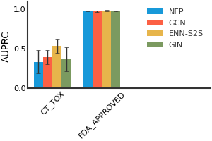

ESOL
^^^^

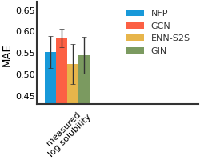
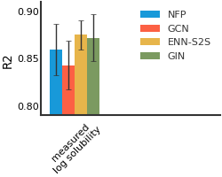

FreeSolv
^^^^^^^^

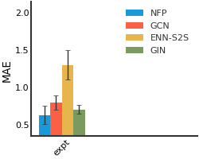
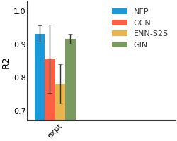

Lipophilicity
^^^^^^^^^^^^^

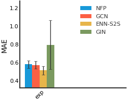
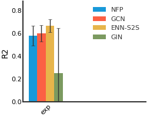

SIDER
^^^^^

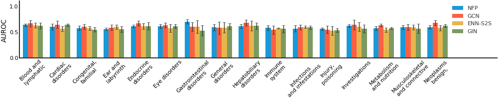
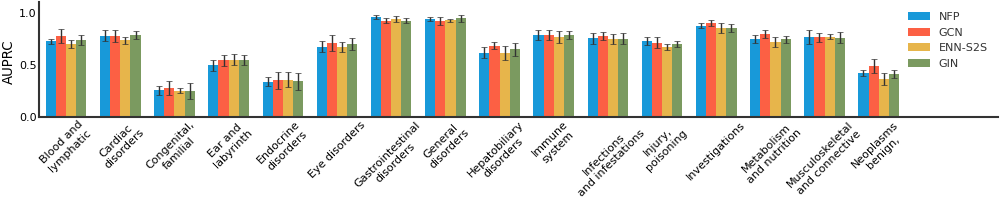

Tox21
^^^^^

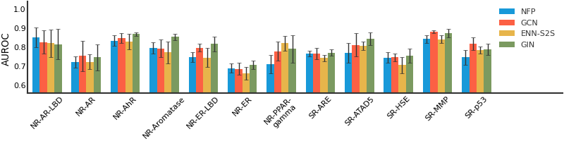
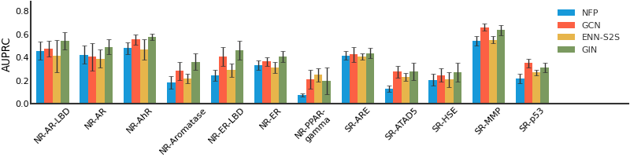

ToxCast
^^^^^^^

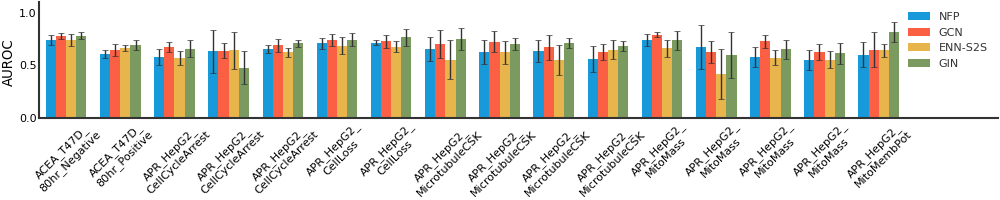
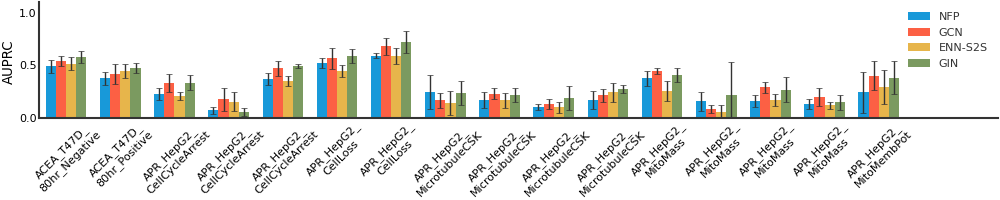

MUV
^^^

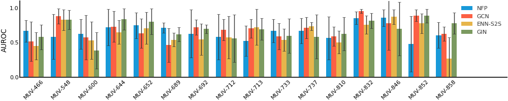
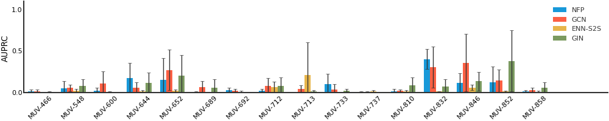

Malaria
^^^^^^^

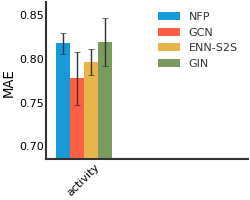
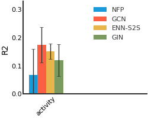

Scaffold Split
--------------

QM9
^^^

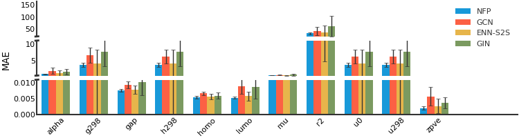
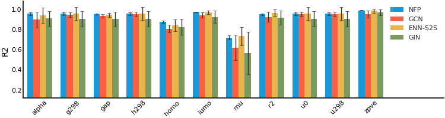

QM8
^^^

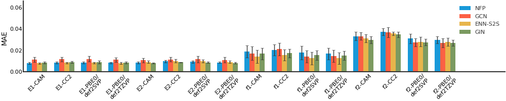
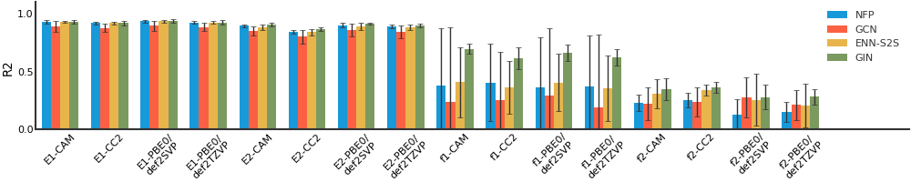

BACE
^^^^

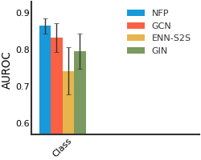
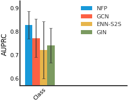

BBBP
^^^^

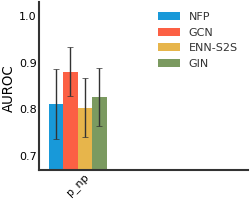
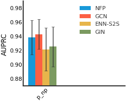

CEP
^^^

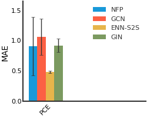
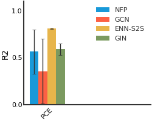

HIV
^^^

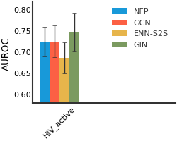
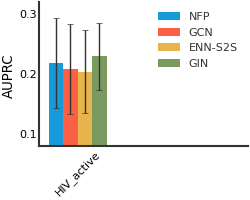

ClinTox
^^^^^^^

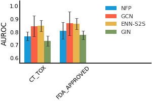
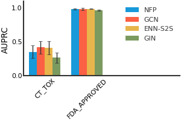

ESOL
^^^^

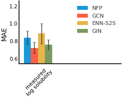
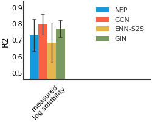

FreeSolv
^^^^^^^^

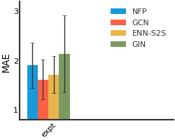
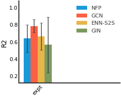

Lipophilicity
^^^^^^^^^^^^^

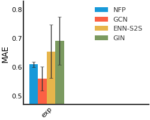
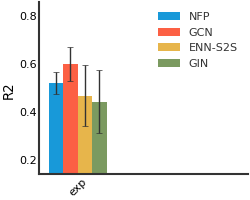

SIDER
^^^^^

Tox21
^^^^^

ToxCast
^^^^^^^

MUV
^^^

Malaria
^^^^^^^

