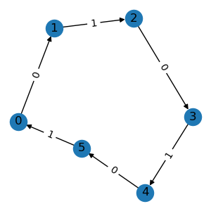
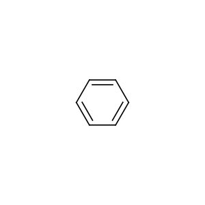
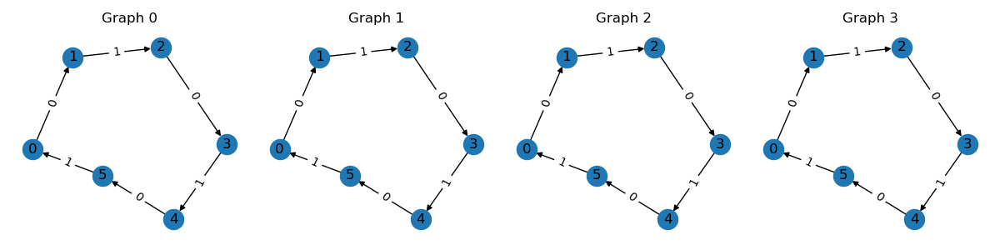
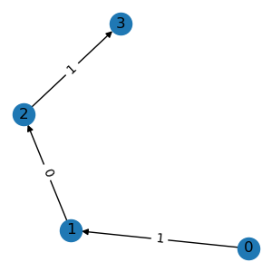
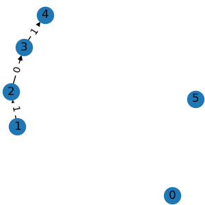
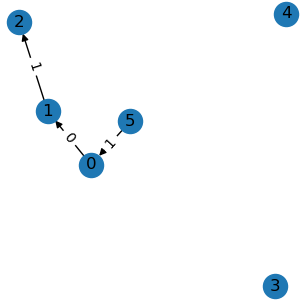
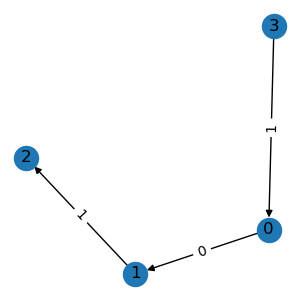
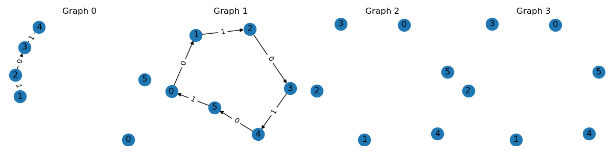
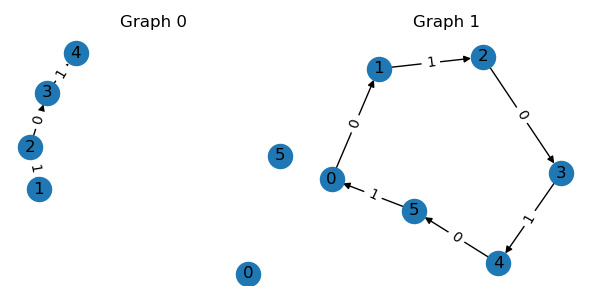

Graph Data Structures
=====================

At the core of TorchDrug, we provides several data structures to enable common
operations in graph representation learning.

Create a Graph
--------------

To begin with, let's create a graph.

.. code:: python

    import torch
    from torchdrug import data

    edge_list = [[0, 1], [1, 2], [2, 3], [3, 4], [4, 5], [5, 0]]
    graph = data.Graph(edge_list, num_node=6)
    graph.visualize()

This will plot a ring graph like the following.

Internally, the graph is stored as a sparse edge list to save memory footprint. For
an intuitive comparison, a `scale-free graph`_ may have 1 million nodes and 10 million
edges. The dense version takes about 4TB, while the sparse version only requires 120MB.

.. _scale-free graph:
    https://en.wikipedia.org/wiki/Scale-free_network

Here are some commonly used properties of the graph.

.. code:: python

    print(graph.num_node)
    print(graph.num_edge)
    print(graph.edge_list)
    print(graph.edge_weight)

In some scenarios, the graph may also have type information on its edges. For example,
molecules have bond types like ``single bound``, while knowledge graphs have relations
like ``consists of``. To construct such a relational graph, we can pass the edge type
as a third variable in the edge list.

.. code:: python

    triplet_list = [[0, 1, 0], [1, 2, 1], [2, 3, 0], [3, 4, 1], [4, 5, 0], [5, 0, 1]]
    graph = data.Graph(triplet_list, num_node=6, num_relation=2)
    graph.visualize()

Alternatively, we can also use adjacency matrices to create the above graphs.

The normal graph uses a 2D adjacency matrix :math:`A`, where non-zero :math:`A_{i,j}`
corresponds to an edge from node :math:`i` to node :math:`j`. The relational graph
uses a 3D adjacency matrix :math:`A`, where non-zero :math:`A_{i,j,k}` denotes an
edge from node :math:`i` to node :math:`j` with edge type :math:`k`.

.. code:: python

    adjacency = torch.zeros(6, 6)
    adjacency[edge_list] = 1
    graph = data.Graph.from_dense(adjacency)

    adjacency = torch.zeros(6, 6, 2)
    adjacency[triplet_list] = 1
    graph = data.Graph.from_dense(adjacency)

For molecule graphs, TorchDrug supports creating instances from `SMILES`_ strings.
For example, the following code creates a benzene molecule.

.. _SMILES:
    https://en.wikipedia.org/wiki/Simplified_molecular-input_line-entry_system

.. code:: python

    mol = data.Molecule.from_smiles("C1=CC=CC=C1")
    mol.visualize()

Once the graph is created, we can transfer it between CPU and GPUs, just like
:class:`torch.Tensor`.

.. code:: python

    graph = graph.cuda()
    print(graph.device)

    graph = graph.cpu()
    print(graph.device)

Graph Attributes
----------------

A common practice in graph representation learning is to add some graph features as
the input of neural networks. Typically, there are three types of features, node-level,
edge-level and graph-level features. In TorchDrug, these features are stored as
node/edge/graph attributes in the data structure, and are automatically processed
during any graph operation.

Here we specify some features during the construction of the molecule graph.

.. code:: python

    mol = data.Molecule.from_smiles("C1=CC=CC=C1", atom_feature="default",
                                    bond_feature="default", mol_feature="ecfp")
    print(mol.node_feature.shape)
    print(mol.edge_feature.shape)
    print(mol.graph_feature.shape)

There are a bunch of popular feature functions provided in :mod:`torchdrug.data.feature`.
We may also want to define our own attributes. This only requires to wrap the
assignment lines with a context manager. The following example defines edge importance
as the reciprocal of node degrees.

.. code:: python

    node_in, node_out = mol.edge_list.t()[:2]
    with mol.edge():
        mol.edge_importance = 1 / graph.degree_in[node_in] + 1 / graph.degree_out[node_out]

We can use ``mol.node()`` and ``mol.graph()`` for node- and graph-level attributes
respectively. Attributes may also be a reference to node/edge/graph indexes. See
:doc:`reference` for more details.

Note in order to support batching and masking, attributes should always have the same
length as their corresponding components. This means the size of the first dimension of
the tensor should be either ``num_node``, ``num_edge`` or ``1``.

Batch Graph
-----------

Modern deep learning frameworks employs batched operations to accelerate computation.
In TorchDrug, we can easily batch same kind of graphs with **arbitary sizes**. Here
is an example of creating a batch of 4 graphs.

.. code:: python

    graphs = [graph, graph, graph, graph]
    batch = data.Graph.pack(graphs)
    batch.visualize(num_row=1)

This returns a :class:`PackedGraph <torchdrug.data.PackedGraph>` instance with
all attributes automatically batched. The essential trick behind this operation is
based on a property of graphs. A batch of :math:`n` graphs is equivalent to a large
graph with :math:`n` connected components. The equivalent adjacency matrix for a
batch is

.. math::

    A =
    \begin{bmatrix}
        A_1    & \cdots & 0      \\
        \vdots & \ddots & \vdots \\
        0      & \cdots & A_n
    \end{bmatrix}

where :math:`A_i` is the adjacency of :math:`i`-th graph.

To get a single graph from the batch, use the conventional index or
:meth:`PackedGraph.unpack <torchdrug.data.PackedGraph.unpack>`.

.. code:: python

    graph = batch[1]
    graphs = batch.unpack()

One advantage of such batching mechanism is that it does not distinguish a single
graph and a batch. In other words, we only need to implement single graph operations,
and they can be directly applied as batched operations. This reduces the pain of
writing batched operations.

Subgraph and Masking
--------------------

The graph data structure also provides a bunch of slicing operations to create subgraphs
or masked graphs in a sparse manner. Some typical operations include

.. code:: python

    g1 = graph.subgraph([1, 2, 3, 4])
    g1.visualize()

    g2 = graph.node_mask([1, 2, 3, 4])
    g2.visualize()

    g3 = graph.edge_mask([0, 1, 5])
    g3.visualize()

    g4 = g3.compact()
    g4.visualize()

All the above operations accept either integer node indexes or binary node masks.
:meth:`subgraph() <torchdrug.data.Graph.subgraph>` extracts a subgraph based on
the given nodes. The node ids are re-mapped to produce a compact index.
:meth:`node_mask() <torchdrug.data.Graph.node_mask>` keeps edges among the given
nodes. :meth:`edge_mask() <torchdrug.data.Graph.edge_mask>` keeps edges of the
given edge indexes. :meth:`compact() <torchdrug.data.Graph.compact>` removes all
isolated nodes.

The same operations can also be applied to batches. In this case, we need to convert
the index of a single graph into the index in a batch.

.. code:: python

    graph_ids = torch.tensor([0, 0, 0, 0, 1, 1, 1, 1, 1, 1])
    node_ids = torch.tensor([1, 2, 3, 4, 0, 1, 2, 3, 4, 5])
    node_ids += batch.num_cum_nodes[graph_ids] - batch.num_nodes[graph_ids]
    batch = batch.node_mask(node_ids)
    batch.visualize(num_row=1)

We can also pick a subset of graphs in a batch.

.. code:: python

    batch = batch[[0, 1]]
    batch.visualize()

