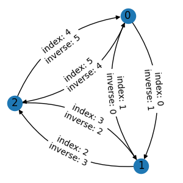
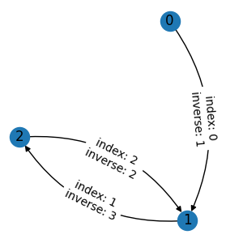

Deal with References
====================

As we show in :doc:`graph`, custom graph attributes will be automatically processed
in any graph operation. However, some attributes may refer to node/edge/graph indexes,
and their values need to be modified when the indexes change. TorchDrug provides a
mechanism to deal with such cases.

Inverse Edge Index
------------------

A typical example of reference is a mapping from each edge to its inverse edge.
We first prepare an undirected graph with the indexes of inverse edges.

.. code:: python

    import torch
    from torchdrug import data

    edge_list = [[0, 1], [1, 0], [1, 2], [2, 1], [2, 0], [0, 2]]
    inv_edge_index = [1, 0, 3, 2, 5, 4]
    graph = data.Graph(edge_list, num_node=3)

If we assign the indexes as an edge attribute and apply an edge mask operation,
the result is not desired. The edges are masked out correctly, but the values of
inverse indexes are wrong.

.. code:: python
    with graph.edge():
        graph.inv_edge_index = torch.tensor(inv_edge_index)
    g1 = graph.edge_mask([0, 2, 3])

Instead, we need to explicitly tell TorchDrug that the attribute ``graph.inv_edge_index``
is a reference to edge indexes. This is done by an additional context manager
``graph.edge_reference()``. Now we get the correct inverse indexes. Note that missing
references will be set to ``-1``. In this case, the inverse index of ``0`` is ``-1``,
since the corresponding inverse edge has been masked out.

.. code:: python

    with graph.edge(), graph.edge_reference():
        graph.inv_edge_index = torch.tensor(inv_edge_index)
    g2 = graph.edge_mask([0, 2, 3])

We can use ``graph.node_reference()`` and ``graph.graph_reference()`` for references
to nodes and graphs respectively.

Use Cases in Proteins
---------------------

In :class:`data.Protein`, the mapping ``atom2residue`` is implemented as
references. The intuition is that references enable flexible indexing on either atoms
or residues, while maintaining the correspondence between two views.

The following example shows how to track a specific residue with ``atom2residue`` in
the atom view. For a protein, we first create a mask for atoms in a glutamine (GLN).

.. code:: python

    protein = data.Protein.from_sequence("KALKQMLDMG")
    is_glutamine = protein.residue_type[protein.atom2residue] == protein.residue2id["GLN"]
    with protein.node():
        protein.is_glutamine = is_glutamine

We then apply a mask to the protein residue sequence. In the output protein,
``atom2residue`` is able to map the masked atoms back to the glutamine residue.

.. code:: python

    p1 = protein[3:6]
    residue_type = p1.residue_type[p1.atom2residue[p1.is_glutamine]]
    print([p1.id2residue[r] for r in residue_type.tolist()])

.. code:: bash

    ['GLN', 'GLN', 'GLN', 'GLN', 'GLN', 'GLN', 'GLN', 'GLN', 'GLN']