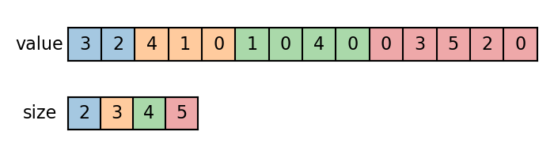
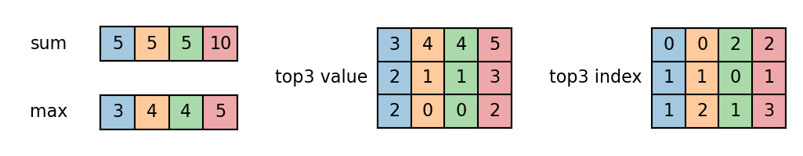
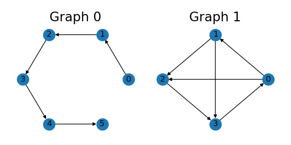
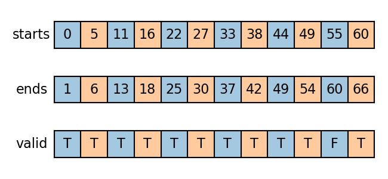
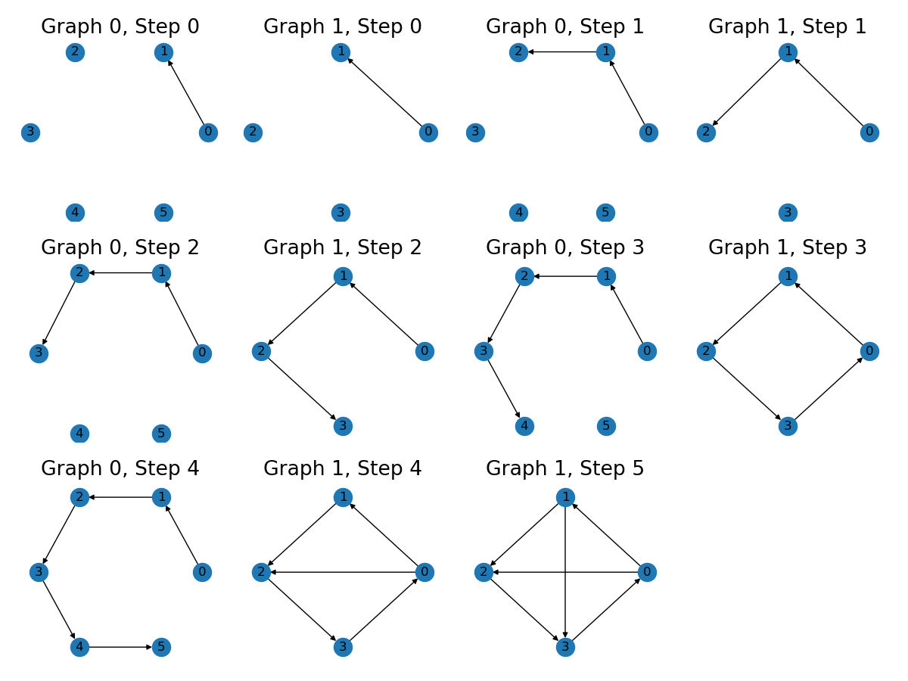

Batch Irregular Structures
==========================

Unlike images, text and audio, graphs usually have irregular structures, which
makes them hard to batch in tensor frameworks. Many existing implementations use
padding to convert graphs into dense grid structures, which costs much unnecessary
computation and memory.

In TorchDrug, we develop a more intuitive and efficient solution based on
variadic functions. The variadic functions can directly operate on sparse irregular
inputs or outputs.

Variadic Input
--------------

Here we show how to apply functions to variadic inputs.

Generally, a batch of :math:`n` variadic tensors can be represented by a value
tensor and a size tensor. The value tensor is a concatenation of all variadic
tensors along the variadic axis, while the size tensor indicates how big each
variadic tensor is.

Let's first create a batch of 1D variadic samples.

.. code:: python

    import torch

    samples = []
    for size in range(2, 6):
        samples.append(torch.randint(6, (size,)))
    value = torch.cat(samples)
    size = torch.tensor([len(s) for s in samples])

We apply variadic functions to compute the sum, max and top-k values for each
sample.

.. code:: python

    from torchdrug.layers import functional

    sum = functional.variadic_sum(value, size)
    max = functional.variadic_max(value, size)[0]
    top3_value, top3_index = functional.variadic_topk(value, size, k=3)

Note :meth:`variadic_topk <torchdrug.layers.functional.variadic_topk>` accepts
samples smaller than :math:`k`. In this case, it will fill the output with the
smallest element from that sample.

Mathematically, these functions can be viewed as performing the operation over
each sample with a for loop. For example, the variadic sum is equivalent to the
following logic.

.. code::

    sums = []
    for sample in samples:
        sums.append(sample.sum())
    sum = torch.cat(sums)

.. note::

    In spite of the same logic, variadic functions is much faster than for loops
    on GPUs (typically :math:`\text{batch size}\times` faster). Use variadic functions
    instead of for loops whenever possible.

Many operations in graph representation learning can be implemented by variadic
functions. For example,

1. Infer graph-level representations from node-/edge-level representations.
2. Perform classification over nodes/edges.

Here we demonstrate how to perform classification over nodes. We create a toy
task, where the model needs to predict the heaviest atom of each molecule. Note
that node attributes form variadic tensors with ``num_nodes`` from the same graph.
Therefore, we can use :meth:`variadic_max <torchdrug.layers.functional.variadic_max>`
to get our ground truth.

.. code:: python

    from torchdrug import data, models, metrics

    smiles_list = ["CC(=C)C#N", "CCNC(=S)NCC", "BrC1=CC=C(Br)C=C1"]
    graph = data.PackedMolecule.from_smiles(smiles_list)
    target = functional.variadic_max(graph.atom_type, graph.num_nodes)[1]

Naturally, the prediction over nodes also forms a variadic tensor with ``num_nodes``.

.. code:: python

    model = models.GCN(input_dim=graph.node_feature.shape[-1], hidden_dims=[128, 128, 1])
    feature = model(graph, graph.node_feature.float())
    pred = feature["node_feature"].squeeze(-1)

    pred_prob, pred_index = functional.variadic_max(pred, graph.num_nodes)
    loss = functional.variadic_cross_entropy(pred, target, graph.num_nodes)
    accuracy = metrics.variadic_accuracy(pred, target, graph.num_nodes)

.. seealso::
    :func:`variadic_sum <torchdrug.layers.functional.variadic_sum>`,
    :func:`variadic_mean <torchdrug.layers.functional.variadic_mean>`,
    :func:`variadic_max <torchdrug.layers.functional.variadic_max>`,
    :func:`variadic_arange <torchdrug.layers.functional.variadic_arange>`,
    :func:`variadic_sort <torchdrug.layers.functional.variadic_sort>`,
    :func:`variadic_topk <torchdrug.layers.functional.variadic_topk>`,
    :func:`variadic_randperm <torchdrug.layers.functional.variadic_randperm>`,
    :func:`variadic_sample <torchdrug.layers.functional.variadic_sample>`,
    :func:`variadic_meshgrid <torchdrug.layers.functional.variadic_meshgrid`,
    :func:`variadic_softmax <torchdrug.layers.functional.variadic_softmax>`,
    :func:`variadic_log_softmax <torchdrug.layers.functional.variadic_log_softmax>`,
    :func:`variadic_cross_entropy <torchdrug.layers.functional.variadic_cross_entropy>`,
    :func:`variadic_accuracy <torchdrug.metrics.variadic_accuracy>`

Variadic Output
---------------

In some cases, we also need to write functions that produce variadic outputs. A
typical example is autoregressive generation, where we need to generate all
node/edge prefixes of a graph. When this operation is batched, we need to output
variadic numbers of graphs for different input graphs.

Here we show how to generate edge prefixes for a batch of graphs in TorchDrug.
First, let's prepare a batch of two graphs.

.. code:: python

    edge_list = [[0, 1], [1, 2], [2, 3], [3, 4], [4, 5]]
    graph1 = data.Graph(edge_list, num_node=6)
    edge_list = [[0, 1], [1, 2], [2, 3], [3, 0], [0, 2], [1, 3]]
    graph2 = data.Graph(edge_list, num_node=4)
    graph = data.Graph.pack([graph1, graph2])
    with graph.graph():
        graph.id = torch.arange(2)

The generation of edge prefixes consists 3 steps.

1. Construct an extended batch with enough copies for each graph.
2. Apply an edge mask over the batch.
3. Remove excess or invalid graphs.

The first step can be implemented through
:meth:`Graph.repeat <torchdrug.data.Graph.repeat>`. For the following steps, we
define an auxiliary function ``all_prefix_slice``. This function takes in a size
tensor and desired prefix lengths, and outputs :math:`n*l` prefix slices for the
extended batch, where :math:`n` is the batch size and :math:`l` is the number of
prefix lengths.

.. code:: python

    def all_prefix_slice(size, lengths=None):
        cum_sizes = sizes.cumsum(0)
        starts = cum_sizes - sizes
        if lengths is None:
            max_size = sizes.max().item()
            lengths = torch.arange(0, max_size, 1, device=sizes.device)

        pack_offsets = torch.arange(len(lengths), device=sizes.device) * num_cum_xs[-1]
        starts = starts.unsqueeze(0) + pack_offsets.unsqueeze(-1)
        valid = lengths.unsqueeze(-1) <= sizes.unsqueeze(0)
        lengths = torch.min(lengths.unsqueeze(-1), sizes.unsqueeze(0)).clamp(0)
        ends = starts + lengths

        starts = starts.flatten()
        ends = ends.flatten()
        valid = valid.flatten()

        return starts, ends, valid

    lengths = torch.arange(1, graph.num_edges.max() + 1)
    num_length = len(lengths)
    starts, ends, valid = all_prefix_slice(graph.num_edges, lengths)

The slices are visualized as follows. Two colors correspond to two input graphs.

.. code:: python

    graph = graph.repeat(num_length) # step 1
    mask = functional.multi_slice_mask(starts, ends)
    graph = graph.edge_mask(mask) # step 2
    graph = graph[valid] # step 3

The output batch is

