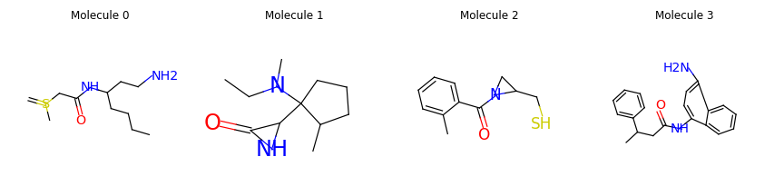
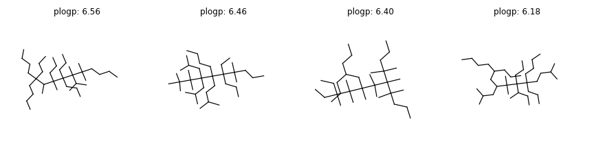

Molecule Generation
===================

.. include:: ../bibliography.rst

Molecular graph generation is a fundamental problem for drug discovery and has
been attracting growing attention. The problem is challenging since it requires
not only generating chemically valid molecular structures but also optimizing
their chemical properties in the meantime.

In this tutorial, we will implement two graph generative models `GCPN`_ and
`GraphAF`_. We first pretrain both models on `ZINC250k`_ dataset. Starting from
the pretrained checkpoint, we finetune both models with reinforcement learning to
optimize two properties (i.e., QED and penalized logP score) of generated
molecules.

Prepare the Pretraining Dataset
-------------------------------

We use `ZINC250k`_ dataset for pretraining. The dataset contains 250,000 drug-like
molecules with a maximum atom number of 38. It has 9 atom types and 3 edge types.

First, let's donwload, load, and preprocess the dataset, which takes about 3-5 minutes.
You are encouraged to dump the preprocessed dataset to save the time for future use.

.. code:: python

    import torch
    from torchdrug import datasets

    dataset = datasets.ZINC250k("~/molecule-datasets/", kekulize=True,
                                atom_feature="symbol")
    # with open("path_to_dump/zinc250k.pkl", "wb") as fout:
    #     pickle.dump(dataset, fout)
    # with open("path_to_dump/zinc250k.pkl", "rb") as fin:
    #     dataset = pickle.load(fin)

Define the Model: GCPN
----------------------

The model consists of two parts, a graph representation model and a graph generative
module. We define a Relational Graph Convolutional Networks (`RGCN`_) as our
representation model. We use the module
:class:`GCPNGeneration <torchdrug.tasks.GCPNGeneration>` as the training task
for GCPN.

.. code:: python

    from torchdrug import core, models, tasks

    model = models.RGCN(input_dim=dataset.node_feature_dim, 
                        num_relation=dataset.num_bond_type,
                        hidden_dims=[256, 256, 256, 256], batch_norm=False)
    task = tasks.GCPNGeneration(model, dataset.atom_types, max_edge_unroll=12,
                                max_node=38, criterion="nll")

Pretraining and Generation: GCPN
--------------------------------

Now we can train our model. We setup an optimizer for our model, and put
everything together into an Engine instance. 
Here we only train the model for 1 epoch, and then save the pretrained model into a directory.

.. code:: python

    from torch import nn, optim
    optimizer = optim.Adam(task.parameters(), lr = 1e-3)
    solver = core.Engine(task, dataset, None, None, optimizer, 
                         gpus=(0,), batch_size=128, log_interval=10)

    solver.train(num_epoch=1)
    solver.save("path_to_dump/graphgeneration/gcpn_zinc250k_1epoch.pkl")

During the pretraining procedure, we may obtain some logs as follows, which report
the accuracy of action predictions.

.. code:: bash

    edge acc: 0.896366
    edge loss: 0.234644
    node1 acc: 0.596209
    node1 loss: 1.04997
    node2 acc: 0.747235
    node2 loss: 0.723717
    stop acc: 0.849681
    stop bce loss: 0.247942
    total loss: 2.25627

After the model is pretrained, we can load the parameters from the checkpoint as follows.
Let's generate some small molecules from the pretrained GCPN model.

.. code:: python

    solver.load("path_to_dump/graphgeneration/gcpn_zinc250k_1epoch.pkl")
    results = task.generate(num_sample=32, max_resample=5)
    print(results.to_smiles())

The results are as follows:

.. code:: bash

    C=S(C)CC(=O)NC(CCN)CCCC
    CCN(C)C1(C2NC2=O)CCCC1C
    CC1=CC=CC=C1C(=O)N1CC1CS
    CN=NC1=NC=CC2=CC=C(C=C2)CCNC(=O)C1
    CC(CC(=O)NC1=CC=C(N)C2=CC=CC=C12)C1=CC=CC=C1
    ...

Let’s visualize some generated molecules.

Goal-Directed Molecule Generation with Reinforcement Learning: GCPN
-------------------------------------------------------------------

For drug discovery, we need to optimize the chemical properties of generated
molecules. In this part, we introduce how to fine-tune the graph generative model
with reinforcement learning to optimize the properties of generated molecules. We
implemented the Proximal Policy Optimization (PPO) algorithm for both GCPN and
GraphAF. To finetune the pretrained model with reinforcement learning, we only
need to modify several lines of code in the task initialization. We provide all the
codes for finetuning in the following segment.

For Penalized logP optimization, the code is as follows:

.. code:: python

    import torch
    from torchdrug import core, datasets, models, tasks
    from torch import nn, optim
    from collections import defaultdict

    dataset = datasets.ZINC250k("~/molecule-datasets/", kekulize=True,
                                atom_feature="symbol")

    model = models.RGCN(input_dim=dataset.node_feature_dim, 
                        num_relation=dataset.num_bond_type,
                        hidden_dims=[256, 256, 256, 256], batch_norm=False)
    task = tasks.GCPNGeneration(model, dataset.atom_types, 
                                max_edge_unroll=12, max_node=38,
                                task="plogp", criterion="ppo",
                                reward_temperature=1,
                                agent_update_interval=3, gamma=0.9)

    optimizer = optim.Adam(task.parameters(), lr=1e-5)
    solver = core.Engine(task, dataset, None, None, optimizer, 
                         gpus=(0,), batch_size=16, log_interval=10)

    solver.load("path_to_dump/graphgeneration/gcpn_zinc250k_1epoch.pkl",
                load_optimizer=False)

    # RL finetuning
    solver.train(num_epoch=10)
    solver.save("path_to_dump/graphgeneration/gcpn_zinc250k_1epoch_finetune.pkl")    

                             
The results are as follows:

.. code:: bash

    (6.56, 'CCCCC(CCC)(CCCC)C(C)C(C)(CCC)C(CCC)(CCC)C(C)(C(C)C)C(C)(C)CCCC')
    (6.46, 'CCCCC(CCC(C)C)(C(CC)(CCC)C(C)(C)CCC)C(CC(C)C)(CC(C)C)C(C)(C)C(C)(C)C')
    (6.40, 'CCCC(CCC)CC(C)(C(C)(C)C(C)(CC)CC)C(C)(C)C(C)(C(C)(C)CCC)C(C)(C)CCC')
    (6.18, 'CCCCC(CCC)CC(CC(C)C)C(C)(C)C(CCC)(C(C)CC)C(CCC)(CCCC)CCC(C)C')
    ...

Let’s visualize some molecules with large Penalized logP scores (> 6).

For QED optimization, the task initialization is as follows:

.. code:: python
    
    task = tasks.GCPNGeneration(model, dataset.atom_types, 
                                max_edge_unroll=12, max_node=38, 
                                task="qed", criterion=("ppo", "nll"),
                                reward_temperature=1,
                                agent_update_interval=3, gamma=0.9)

The results are as follows:

.. code:: bash

    (0.948, 'C1=CC=C(CNC2=NC=NCC3=CN2C(C2=COCC2)=C3)C=C1')
    (0.948, 'CCC1=CC=CC=C1NC(=O)C12CC(=O)N(C1)C1=CC=CC=C12')
    (0.947, 'O=C1CCNC(C2=CC=CN=C2)CN1CC1=CC=CC(Cl)=C1')       
    (0.947, 'CC1=C(C(=O)NC2CCCN(C3=CC=CC=C3)C2)C=CN=C1')
    (0.947, 'CCNC1CCC2=CC=CC(=C2)N(C(=O)C2=CC=CC=N2)C1')
    (0.946, 'O=C(C1=CC=CC=C1F)N1CC2=CC=CC=C2C(CCO)C1')
    ...

Let’s visualize some molecules with large QED scores (> 0.945).

.. image:: ../../../asset/dataset/zinc250k_gcpn_qed_generated.png

Define the Model: GraphAF
-------------------------

The model consists of two parts, a graph representation model and a graph generative
module. We define a Relational Graph Convolutional Networks (`RGCN`_) as our
representation model. We use the module
:class:`AutoregressiveGeneration <torchdrug.tasks.AutoregressiveGeneration>` as
the training task for GraphAF. The task consists of a node flow model and an edge
flow model, which define invertible mapping between node / edge types and noise
distributions.

.. code:: python

    from torchdrug import core, models, tasks
    from torchdrug.layers import distribution

    model = models.RGCN(input_dim=dataset.num_atom_type, 
                        num_relation=dataset.num_bond_type,
                        hidden_dims=[256, 256, 256], batch_norm=True)
                                        
    num_atom_type = dataset.num_atom_type
    # add one class for non-edge
    num_bond_type = dataset.num_bond_type + 1

    node_prior = distribution.IndependentGaussian(torch.zeros(num_atom_type),
                                                  torch.ones(num_atom_type))
    edge_prior = distribution.IndependentGaussian(torch.zeros(num_bond_type),
                                                  torch.ones(num_bond_type))
    node_flow = models.GraphAF(model, node_prior, num_layer=12)
    edge_flow = models.GraphAF(model, edge_prior, use_edge=True, num_layer=12)

    task = tasks.AutoregressiveGeneration(node_flow, edge_flow,
                                          max_node=38, max_edge_unroll=12,
                                          criterion="nll")

Pretraining and Generation: GraphAF
-----------------------------------

Now we can train our model. We setup an optimizer for our model, and put everything
together into an Engine instance. Here we train the model for 10 epochs, and then
save the pretrained model into a directory.

.. code:: python

    from torch import nn, optim
    optimizer = optim.Adam(task.parameters(), lr = 1e-3)
    solver = core.Engine(task, dataset, None, None, optimizer, 
                         gpus=(0,), batch_size=128, log_interval=10)

    solver.train(num_epoch=10)
    solver.save("path_to_dump/graphgeneration/graphaf_zinc250k_10epoch.pkl")

After the model is pretrained, we can load the parameters from the checkpoint.
Let's then generate some small molecules from the pretrained GraphAF model.

.. code:: python

    from collections import defaultdict

    solver.load("path_to_dump/graphgeneration/graphaf_zinc250k_10epoch.pkl")
    results = task.generate(num_sample=32)
    print(results.to_smiles())

The results are as follows:

.. code:: bash

    CC(C)C=C(Cl)NC1=CC=CC=C1
    CCOC(=NNCC(C=CC(C)=CC=CC=CC(C)=CC=O)(CO)CO)C(C)C
    CCC(C)(NC(C)Cl)C1=CC=CNC#CO1
    O=C1NC2=CC(=CC=S)C1=CC=CC=C2
    C=[SH]1(CC)C#SC(=NC(C)=C(C)Cl)C1N
    ...

Finetuning: GraphAF
-------------------

For Penalized logP optimization, the code is as follows:

.. code:: python

    import torch
    from torchdrug import core, datasets, models, tasks
    from torchdrug.layers import distribution
    from torch import nn, optim
    from collections import defaultdict

    dataset = datasets.ZINC250k("~/molecule-datasets/", 
                                kekulize=True, 
                                atom_feature="symbol")

    model = models.RGCN(input_dim=dataset.num_atom_type,
                        num_relation=dataset.num_bond_type,
                        hidden_dims=[256, 256, 256], batch_norm=True)
                                        
    num_atom_type = dataset.num_atom_type
    # add one class for non-edge
    num_bond_type = dataset.num_bond_type + 1

    node_prior = distribution.IndependentGaussian(torch.zeros(num_atom_type),
                                                  torch.ones(num_atom_type))
    edge_prior = distribution.IndependentGaussian(torch.zeros(num_bond_type),
                                                  torch.ones(num_bond_type))
    node_flow = models.GraphAF(model, node_prior, num_layer=12)
    edge_flow = models.GraphAF(model, edge_prior, use_edge=True, num_layer=12)

    task = tasks.AutoregressiveGeneration(node_flow, edge_flow,
                                          max_node=38, max_edge_unroll=12,
                                          task="plogp", criterion="ppo",
                                          reward_temperature=20, baseline_momentum=0.9,
                                          agent_update_interval=5, gamma=0.9)

    optimizer = optim.Adam(task.parameters(), lr=1e-5)
    solver = core.Engine(task, dataset, None, None, optimizer, 
                         gpus=(0,), batch_size=64, log_interval=10)

    solver.load("path_to_dump/graphgeneration/graphaf_zinc250k_10epoch.pkl",
                load_optimizer=False)

    # RL finetuning
    solver.train(num_epoch=10)
    solver.save("path_to_dump/graphgeneration/graphaf_zinc250k_10epoch_finetune.pkl")

                             
The results are as follows:

.. code:: bash

    (5.63, 'CC=CC=CC=CC=CC=CC=CC=CC=CC=CC=CC=CC=CC=CC=CC=CC=C(I)C(C)(C)C')
    (5.60, 'CCC=CC=CC=CC=CC=CC=CC=CC=CC=CC=CC=CC=CC=CC=CC=CC(C)(C)CCC')
    (5.44, 'CC=CC=CC=CC(Cl)=CC=CC=CC=CC=CC=C(C)C=CC=CC=C(C)C=CC(Br)=CC=CCCC')
    (5.35, 'CC=CC=CC=CC=CC=CC=CC=CC=CC=CC=CC=CC=CC=CC=CC=CC=C(CC)C(C)C')
    ...

For QED optimization, the task initialization is as follows:

.. code:: python
    
    task = tasks.AutoregressiveGeneration(node_flow, edge_flow,
                                          max_node=38, max_edge_unroll=12,
                                          task="qed",
                                          criterion={"ppo": 0.25, "nll": 1.0},
                                          reward_temperature=10, baseline_momentum=0.9,
                                          agent_update_interval=5, gamma=0.9)

The results are as follows:

.. code:: bash
    
    (0.948, 'O=S(=O)(NC1=CC=CC=C1Br)C1=CC=CC=N1')
    (0.947, 'CC1CCNC(C2=CC=CC=C2)N1S(=O)(=O)C1=CC=CC=C1')
    (0.947, 'O=C(NCC1=C(Br)C=CC=C1F)C1=CC=CN=C1')    
    (0.947, 'COC1=C(C2=C(Cl)C=CC(S(N)(=O)=O)=C2)C=CC=C1')    
    (0.946, 'O=S(=O)(NC1=CC=CC=C1)C1=CC=C(Br)C=C1')
    (0.945, 'O=S(=O)(NC1=CC=CC(Br)=C1)C1=CC=CC=C1')    
    ...
