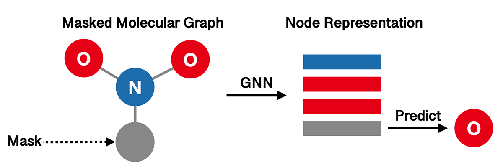

Pretrained Molecular Representations
====================================

.. include:: ../bibliography.rst

In many drug discovery tasks, it is costly in both time and money to collect labeled
data. As a solution, self-supervised pretraining is introduced to learn molecular
representations from massive unlabeled data.

In this tutorial, we will demonstrate how to pretrain a graph neural network on
molecules, and how to finetune the model on downstream tasks.

Self-Supervised Pretraining
---------------------------

Pretraining is an effective approach to transfer learning in Graph Neural Networks 
for graph-level property prediction. Here we focus on pretraining GNNs via different
self-supervised strategies. These methods typically construct unsupervised loss functions 
based on structural information in molecules. 

For illustrative purpose, we only use the `ClinTox`_ dataset in this tutorial, which is
much smaller than the standard pretraining datasets. For real applications, we suggest
using larger datasets like `ZINC2M`_.

Infograph
^^^^^^^^^

`InfoGraph`_ (IG) proposes to maximize the mutual information between the graph-level 
and node-level representations. It learns the model by distinguishing whether a
node-graph pair comes from a single graph or two different graphs. The following
figure illustrates the high-level idea of InfoGraph.

.. image:: ../../../asset/model/infograph.png

We use GIN as our graph represenation model, and wrap it with InfoGraph.

.. code:: python

    import torch
    from torch import nn
    from torch.utils import data as torch_data

    from torchdrug import core, datasets, tasks, models

    dataset = datasets.ClinTox("~/molecule-datasets/", atom_feature="pretrain",
                               bond_feature="pretrain")

    gin_model = models.GIN(input_dim=dataset.node_feature_dim,
                           hidden_dims=[300, 300, 300, 300, 300],
                           edge_input_dim=dataset.edge_feature_dim,
                           batch_norm=True, readout="mean")
    model = models.InfoGraph(gin_model, separate_model=False)

    task = tasks.Unsupervised(model)
    optimizer = torch.optim.Adam(task.parameters(), lr=1e-3)
    solver = core.Engine(task, dataset, None, None, optimizer, gpus=[0], batch_size=256)

    solver.train(num_epoch=100)
    solver.save("clintox_gin_infograph.pth")

After training, the mutual information of the representations might be close to

.. code:: bash

    average graph-node mutual information: 1.30658

Attribute Masking
^^^^^^^^^^^^^^^^^

The aim of `Attribute Masking`_ (AM) is to capture domain knowledge by learning the
regularities of the node/edge attributes distributed over graph structure. The high-level
idea is to predict atom types in molecular graphs from randomly masked node features.

Again, we use GIN as our graph representation model.

.. code:: python

    import torch
    from torch import nn, optim
    from torch.utils import data as torch_data

    from torchdrug import core, datasets, tasks, models

    dataset = datasets.ClinTox("~/molecule-datasets/", atom_feature="pretrain",
                               bond_feature="pretrain")

    model = models.GIN(input_dim=dataset.node_feature_dim,
                       hidden_dims=[300, 300, 300, 300, 300],
                       edge_input_dim=dataset.edge_feature_dim,
                       batch_norm=True, readout="mean")
    task = tasks.AttributeMasking(model, mask_rate=0.15)

    optimizer = optim.Adam(task.parameters(), lr=1e-3)
    solver = core.Engine(task, dataset, None, None, optimizer, gpus=[0], batch_size=256)

    solver.train(num_epoch=100)
    solver.save("clintox_gin_attributemasking.pth")

Typically, the training accuracy and cross entropy may look like the following.

.. code:: bash

    average accuracy: 0.920366
    average cross entropy: 0.22998

Besides InfoGraph and Attribute Masking, there are some other strategies for
pretraining GNNs. See the documentation below for more details.

.. seealso::
    :class:`InfoGraph <torchdrug.models.InfoGraph>`,
    :class:`AttributeMasking <torchdrug.tasks.AttributeMasking>`,
    :class:`EdgePrediction <torchdrug.tasks.EdgePrediction>`,
    :class:`ContextPrediction <torchdrug.tasks.ContextPrediction>`

Finetune on Labeled Datasets
----------------------------

When the GNN pre-training is finished, we can finetune the pre-trained GNN model
on downstream tasks. Here we use `BACE`_ dataset for illustration, which contains
1,513 molecules with binding affinity results a set of inhibitors of human
:math:`\beta`-secretase 1(BACE-1).

First, we download the `BACE`_ dataset and split it into training, validation and
test sets. Note that we need to set the node and edge feature in the dataset as
pretrain in order to make it compatible with the pretrained model.

.. code:: python
    
    dataset = datasets.BACE("~/molecule-datasets/",
                            atom_feature="pretrain", bond_feature="pretrain")
    lengths = [int(0.8 * len(dataset)), int(0.1 * len(dataset))]
    lengths += [len(dataset) - sum(lengths)]
    train_set, valid_set, test_set = data.ordered_scaffold_split(dataset, lengths)

Then, we define the same model as the pre-training stage and set up the optimizer
and solver for our downstream task. The only difference here is that we use
:class:`PropertyPrediction <torchdrug.tasks.PropertyPrediction>` task to support
supervised learning.

.. code:: python

    model = models.GIN(input_dim=dataset.node_feature_dim,
                    hidden_dims=[300, 300, 300, 300, 300],
                    edge_input_dim=dataset.edge_feature_dim,
                    batch_norm=True, readout="mean")
    task = tasks.PropertyPrediction(model, task=dataset.tasks,
                                    criterion="bce", metric=("auprc", "auroc"))

    optimizer = optim.Adam(task.parameters(), lr=1e-3)
    solver = core.Engine(task, train_set, valid_set, test_set, optimizer,
                         gpus=[0], batch_size=256)

Now we can load our pretrained model and finetune it on downstream datasets.

.. code:: python

    checkpoint = torch.load("clintox_gin_attributemasking.pth")["model"]
    task.load_state_dict(checkpoint, strict=False)

    solver.train(num_epoch=100)
    solver.evaluate("valid")

Once the model is trained, we evaluate it on the validation set. The result may be
similar to the following.

.. code:: bash

    auprc [Class]: 0.921956
    auroc [Class]: 0.663004
