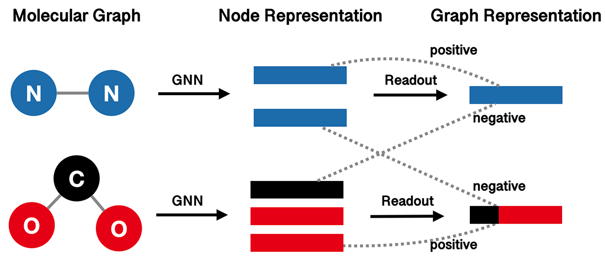

Pretrained Molecular Representations
====================================

.. include:: ../bibliography.rst

For the property prediction task in drug discovery, due to the high expense,
pre-training is a special type of problems in drug discovery tasks.

The self-supervised pre-training belongs to the unsupervised pre-training. It is
unsupervised because no supervised signal, i.e., the molecular drug property, is
provided. It is called the self-supervised because it constructs the positive and
negative views from the data itself. And specifically to the self-supervised
pre-training for molecule property prediction, it explores the structure information
of molecular data from different aspects as illustrated below.

Infograph
---------

`InfoGraph`_ (IG) sets the node- and graph- representation from the same graph as
positive pairs, while those from different graphs as negative pairs.

.. code:: python

    from torch import nn
    from torch.utils import data as torch_data

    from torchdrug import core, datasets, tasks, models

    dataset = datasets.ClinTox("~/molecule-datasets/", node_feature="pretrain",
                               edge_feature="pretrain")

    gin_model = models.GIN(input_dim=dataset.node_feature_dim,
                           hidden_dims=[300, 300, 300, 300, 300],
                           edge_input_dim=dataset.edge_feature_dim,
                           batch_norm=True, readout="mean")
    model = models.InfoGraph(gin_model, separate_model=False)

    task = tasks.Unsupervised(model)
    optimizer = torch.optim.Adam(task.parameters(), lr=1e-3)
    solver = core.Engine(task, dataset, None, None, optimizer, gpus=[0], batch_size=256)

    solver.train(num_epoch=100)

The above is a toy example on `ClinTox`_ dataset, and the output is similar to
the following.

.. code:: bash

    average graph-node mutual information: 1.30658

Attribute Masking
-----------------

`Attribute Masking`_ (AM) predicts the atom node type from its neighbors. It can
be seen as self-supervised by viewing the actual node type as positive, and all
the other node types as negative.

.. code:: python

    from torch import nn, optim
    from torch.utils import data as torch_data

    from torchdrug import core, datasets, tasks, models

    dataset = datasets.ClinTox("~/molecule-datasets/", node_feature="pretrain",
                               edge_feature="pretrain")

    model = models.GIN(input_dim=dataset.node_feature_dim,
                       hidden_dims=[300, 300, 300, 300, 300],
                       edge_input_dim=dataset.edge_feature_dim,
                       batch_norm=True, readout="mean")
    task = tasks.AttributeMasking(model, mask_rate=0.15)

    optimizer = optim.Adam(task.parameters(), lr=1e-3)
    solver = core.Engine(task, dataset, None, None, optimizer, gpus=[0], batch_size=256)

    solver.train(num_epoch=100)

The above is a toy example on `ClinTox`_ dataset, and the output is similar to
the following.

.. code:: bash

    average accuracy: 0.920366
    average cross entropy: 0.22998

.. image:: ../../../asset/graph/attrmasking.png

We also include other popular self-supervised pre-training methods as below:

.. seealso::
    :func:`Edge Prediction (EP) <torchdrug.tasks.EdgePrediction>`
    :func:`Context Prediction (CP) <torchdrug.tasks.ContextPrediction>`
