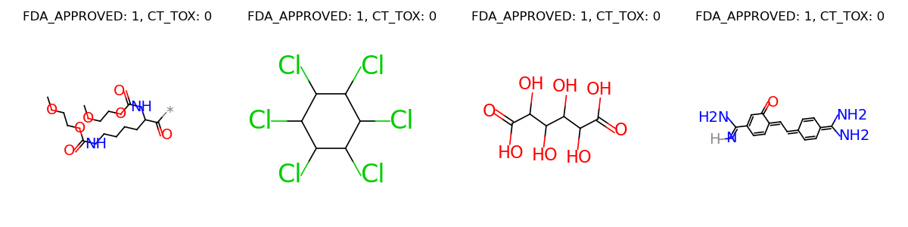
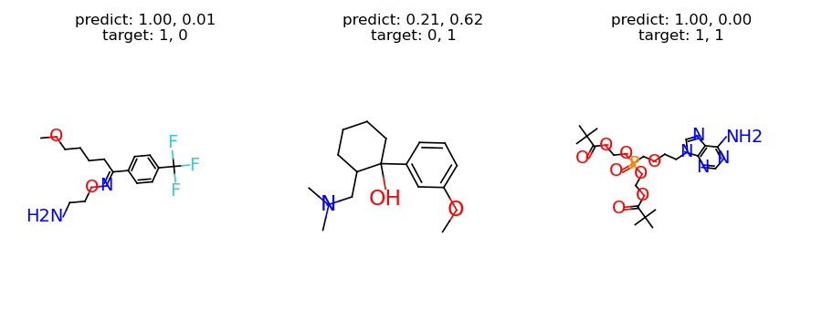

Property Prediction
===================

.. include:: ../bibliography.rst

In this tutorial, we will learn how to use TorchDrug to train a graph neural
network for molecule property prediction. Property prediction is aimed at predicting
the chemical properties of a molecule based on its graph structure and features.

Prepare the Dataset
-------------------

We use `ClinTox`_ dataset for illustration. `ClinTox`_ contains 1,484 molecules
labeled with FDA approvment status and toxity status in clinical trials.

Here we download the dataset and split it into training, validation and test sets.
The splits for train/valid/test sets are 80%, 10% and 10% respectively.

.. code:: python

    import torch
    from torchdrug import data, datasets

    dataset = datasets.ClinTox("~/molecule-datasets/")
    lengths = [int(0.8 * len(dataset)), int(0.1 * len(dataset))]
    lengths += [len(dataset) - sum(lengths)]
    train_set, valid_set, test_set = torch.utils.data.random_split(dataset, lengths)

Let's visualize some samples from the dataset.

.. code:: python

    graphs = []
    labels = []
    for i in range(4):
        sample = dataset[i]
        graphs.append(sample.pop("graph"))
        label = ["%s: %d" % (k, v) for k, v in sample.items()]
        label = ", ".join(label)
        labels.append(label)
    graph = data.Molecule.pack(graphs)
    graph.visualize(labels, num_row=1)

Define our Model
----------------

The model consists of two parts, a task-independent graph representation model
and a task-specific module. We define a Graph Isomorphism Network (GIN) with 4
hidden layers as our representation model. The two prediction tasks will be jointly
optimized through multi-task training by the task-specific module.

.. code:: python

    from torchdrug import core, models, tasks, utils

    model = models.GIN(input_dim=dataset.node_feature_dim,
                       hidden_dims=[256, 256, 256, 256],
                       short_cut=True, batch_norm=True, concat_hidden=True)
    task = tasks.PropertyPrediction(model, task=dataset.tasks,
                                    criterion="bce", metric=("auprc", "auroc"))

Train and Test
--------------

Now we can train our model. We setup an optimizer for our model, and put
everything together into an Engine instance. It may take a few minutes to train
our model.

.. code:: python

    optimizer = torch.optim.Adam(task.parameters(), lr=1e-3)
    solver = core.Engine(task, train_set, valid_set, test_set, optimizer,
                         gpus=[0], batch_size=1024)
    solver.train(num_epoch=100)
    solver.evaluate("valid")

Once the model is trained, we evaluate it on the validation set. The result may be
similar to the following.

.. code:: bash

    auprc [CT_TOX]: 0.455744
    auprc [FDA_APPROVED]: 0.985126
    auroc [CT_TOX]: 0.861976
    auroc [FDA_APPROVED]: 0.816788

To have some intuition of the model, we can investigate the predictions from our
model. The following code selects one sample for each category, and plots the results.

.. code:: python

    from torch.nn import functional as F

    samples = []
    categories = set()
    for sample in valid_set:
        category = tuple([v for k, v in sample.items() if k != "graph"])
        if category not in categories:
            categories.add(category)
            samples.append(sample)
    samples = data.graph_collate(samples)
    samples = utils.cuda(samples)

    preds = F.sigmoid(task.predict(samples))
    targets = task.target(samples)

    titles = []
    for pred, target in zip(preds, targets):
        pred = ", ".join(["%.2f" % p for p in pred])
        target = ", ".join(["%d" % t for t in target])
        titles.append("predict: %s\ntarget: %s" % (pred, target))
    graph = samples["graph"]
    graph.visualize(titles, figure_size=(3, 3.5), num_row=1)

