Retrosynthesis
==============

.. include:: ../bibliography.rst

Retrosynthesis is a fundamental task in drug discovery. Given a target molecule,
the goal of retrosynthesis is to identify a set of reactants that can produce
the target.

In this example, we will show how to predict retrosynthesis using `G2Gs`_ framework.
`G2Gs`_ first identifies the reaction centers, i.e., bonds generated in the
product. Based on the reaction centers, the product is broken into several
synthons and each synthon is translated to a reactant.

Prepare the Dataset
-------------------

We use the standard `USPTO50k`_ dataset. This dataset contains 50k molecules and
their synthesis pathways.

First, let's download and load the dataset. This may take a while.

There are two modes to load the dataset. The reaction mode loads the dataset as
``(reactants, product)`` pairs, which is used for center identification. The synthon
mode loads the dataset as ``(reactant, synthon)`` pairs, which is used for synthon
completion.

.. code:: python

    from torchdrug import data, datasets, utils

    reaction_dataset = datasets.USPTO50k("~/molecule-datasets/",
                                         atom_feature="center_identification",
                                         kekulize=True)
    synthon_dataset = datasets.USPTO50k("~/molecule-datasets/", as_synthon=True,
                                        atom_feature="synthon_completion",
                                        kekulize=True)

Then we visualize some samples from the dataset. For the reaction dataset, we can
split reactant and product graphs into individual molecules using
:meth:`connected_components() <torchdrug.data.Graph.connected_components>`.
Note `USPTO50k`_ ignores all non-target products, so there is only one product on
the right hand side.

.. code:: python

    from torchdrug.utils import plot

    for i in range(2):
        sample = reaction_dataset[i]
        reactant, product = sample["graph"]
        reactants = reactant.connected_components()[0]
        products = product.connected_components()[0]
        plot.reaction(reactants, products)

.. image:: ../../../asset/dataset/uspto50k_0.png
    :width: 49%
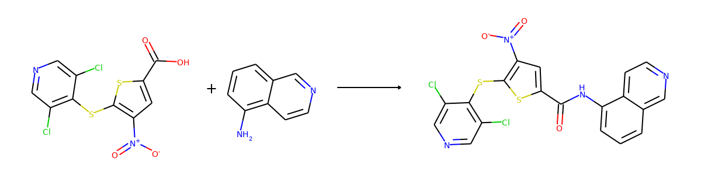

Here are the corresponding samples in the synthon dataset.

.. code:: python

    for i in range(3):
        sample = synthon_dataset[i]
        reactant, synthon = sample["graph"]
        plot.reaction([reactant], [synthon])

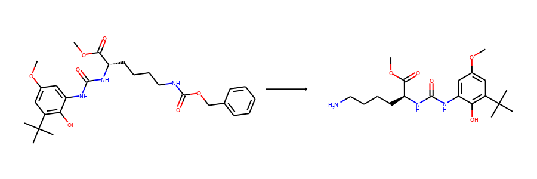
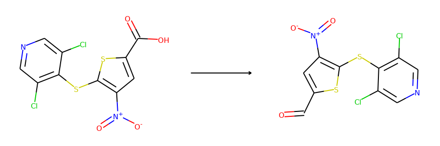
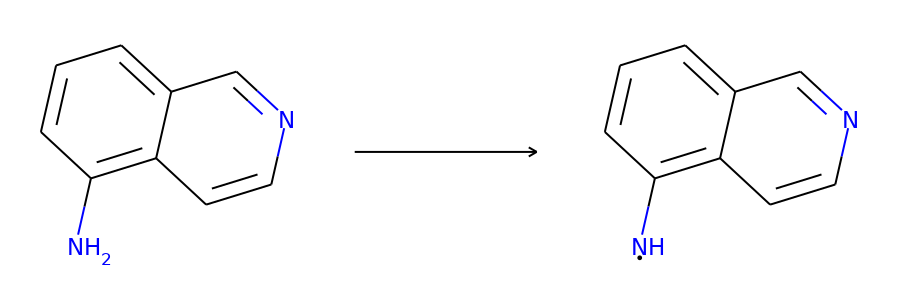

To ensure the same split is used by both datasets, we can set the random seed
before calling :meth:`split() <torchdrug.datasets.USPTO50k.split>`.

.. code::

    import torch

    torch.manual_seed(1)
    reaction_train, reaction_valid, reaction_test = reaction_dataset.split()
    torch.manual_seed(1)
    synthon_train, synthon_valid, synthon_test = synthon_dataset.split()

Center Identification
---------------------

Now we define our model. We use a Relational Graph Convolutional Network (RGCN)
as our representation model, and wrap it for the center identification task. Note
other graph representation learning models can also be used here.

.. code:: python

    from torchdrug import core, models, tasks

    reaction_model = models.RGCN(input_dim=reaction_dataset.node_feature_dim,
                        hidden_dims=[256, 256, 256, 256, 256, 256],
                        num_relation=reaction_dataset.num_bond_type,
                        concat_hidden=True)
    reaction_task = tasks.CenterIdentification(reaction_model,
                                               feature=("graph", "atom", "bond"))

.. code:: python

    reaction_optimizer = torch.optim.Adam(reaction_task.parameters(), lr=1e-3)
    reaction_solver = core.Engine(reaction_task, reaction_train, reaction_valid,
                                  reaction_test, reaction_optimizer,
                                  gpus=[0], batch_size=128)
    reaction_solver.train(num_epoch=50)
    reaction_solver.evaluate("valid")
    reaction_solver.save("g2gs_reaction_model.pth")

The evaluation result on the validation set may look like

.. code:: bash

    accuracy: 0.836367

We can show some predictions from our model. For diversity, we collect samples
from 4 different reaction types.

.. code:: python

    batch = []
    reaction_set = set()
    for sample in reaction_valid:
        if sample["reaction"] not in reaction_set:
            reaction_set.add(sample["reaction"])
            batch.append(sample)
            if len(batch) == 4:
                break
    batch = data.graph_collate(batch)
    batch = utils.cuda(batch)
    result = reaction_task.predict_synthon(batch)

The following code visualizes the ground truths as well as our predictions on the
samples. We use blue for ground truths, red for wrong predictions, and purple for
correct predictions.

.. code:: python

    def atoms_and_bonds(molecule, reaction_center):
        is_reaction_atom = (molecule.atom_map > 0) & \
                           (molecule.atom_map.unsqueeze(-1) == \
                            reaction_center.unsqueeze(0)).any(dim=-1)
        node_in, node_out = molecule.edge_list.t()[:2]
        edge_map = molecule.atom_map[molecule.edge_list[:, :2]]
        is_reaction_bond = (edge_map > 0).all(dim=-1) & \
                           (edge_map == reaction_center.unsqueeze(0)).all(dim=-1)
        atoms = is_reaction_atom.nonzero().flatten().tolist()
        bonds = is_reaction_bond[node_in < node_out].nonzero().flatten().tolist()
        return atoms, bonds

    products = batch["graph"][1]
    reaction_centers = result["reaction_center"]

    for i, product in enumerate(products):
        true_atoms, true_bonds = atoms_and_bonds(product, product.reaction_center)
        true_atoms, true_bonds = set(true_atoms), set(true_bonds)
        pred_atoms, pred_bonds = atoms_and_bonds(product, reaction_centers[i])
        pred_atoms, pred_bonds = set(pred_atoms), set(pred_bonds)
        overlap_atoms = true_atoms.intersection(pred_atoms)
        overlap_bonds = true_bonds.intersection(pred_bonds)
        atoms = true_atoms.union(pred_atoms)
        bonds = true_bonds.union(pred_bonds)

        red = (1, 0.5, 0.5)
        blue = (0.5, 0.5, 1)
        purple = (1, 0.5, 1)
        atom_colors = {}
        bond_colors = {}
        for atom in atoms:
            if atom in overlap_atoms:
                atom_colors[atom] = purple
            elif atom in pred_atoms:
                atom_colors[atom] = red
            else:
                atom_colors[atom] = blue
        for bond in bonds:
            if bond in overlap_bonds:
                bond_colors[bond] = purple
            elif bond in pred_bonds:
                bond_colors[bond] = red
            else:
                bond_colors[bond] = blue

        plot.highlight(product, atoms, bonds, atom_colors, bond_colors)

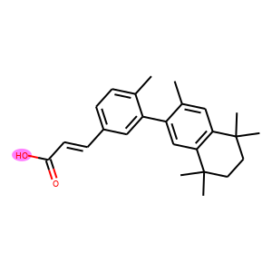
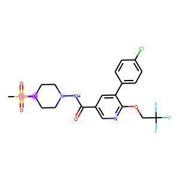
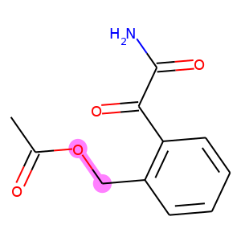
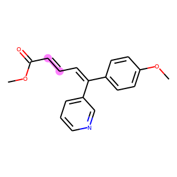

Synthon Completion
------------------

Similarly, we train a synthon completion model on the synthon dataset.

.. code:: python

    synthon_model = models.RGCN(input_dim=synthon_dataset.node_feature_dim,
                                hidden_dims=[256, 256, 256, 256, 256, 256],
                                num_relation=synthon_dataset.num_bond_type,
                                concat_hidden=True)
    synthon_task = tasks.SynthonCompletion(synthon_model, feature=("graph",))

.. code:: python

    synthon_optimizer = torch.optim.Adam(synthon_task.parameters(), lr=1e-3)
    synthon_solver = core.Engine(synthon_task, synthon_train, synthon_valid,
                                 synthon_test, synthon_optimizer,
                                 gpus=[0], batch_size=128)
    synthon_solver.train(num_epoch=10)
    synthon_solver.evaluate("valid")
    synthon_solver.save("g2gs_synthon_model.pth")

We may obtain some results like

.. code:: bash

    bond accuracy: 0.983013
    node in accuracy: 0.967535
    node out accuracy: 0.892999
    stop accuracy: 0.929348
    total accuracy: 0.844374

We then perform beam search to generate reactant candidates.

.. code:: python

    batch = []
    reaction_set = set()
    for sample in synthon_valid:
        if sample["reaction"] not in reaction_set:
            reaction_set.add(sample["reaction"])
            batch.append(sample)
            if len(batch) == 4:
                break
    batch = data.graph_collate(batch)
    batch = utils.cuda(batch)
    reactants, synthons = batch["graph"]
    reactants = reactants.ion_to_molecule()
    predictions = synthon_task.predict_reactant(batch, num_beam=10, max_prediction=5)

    synthon_id = -1
    i = 0
    titles = []
    graphs = []
    for prediction in predictions:
        if synthon_id != prediction.synthon_id:
            synthon_id = prediction.synthon_id.item()
            i = 0
            graphs.append(reactants[synthon_id])
            titles.append("Truth %d" % synthon_id)
        i += 1
        graphs.append(prediction)
        if reactants[synthon_id] == prediction:
            titles.append("Prediction %d-%d, Correct!" % (synthon_id, i))
        else:
            titles.append("Prediction %d-%d" % (synthon_id, i))

    # reset attributes so that pack can work properly
    mols = [graph.to_molecule() for graph in graphs]
    graphs = data.PackedMolecule.from_molecule(mols)
    graphs.visualize(titles, save_file="uspto50k_synthon_valid.png", num_col=6)

For each row in the visualization, the first molecule corresponds to the ground truth.
The rest molecules are candidates from beam search, ordered by their log likelihood.
We can see that our model can recall ground truth in top-5 predictions for most samples.

.. image:: ../../../asset/dataset/uspto50k_synthon_g2gs_valid.png

Retrosynthesis
--------------

Given the trained models, we can combine them into an end2end pipeline for
retrosynthesis. This is done by wrapping the two sub tasks with a retrosynthesis task.

Note if you never declare the solvers for ``reaction_task`` and ``synthon_task``,
you need to manually call their ``preprocess()`` method before combining them into a
pipeline.

.. code:: python

    # reaction_task.preprocess(reaction_train, None, None)
    # synthon_task.preprocess(synthon_train, None, None)
    task = tasks.Retrosynthesis(reaction_task, synthon_task, center_topk=2,
                                num_synthon_beam=5, max_prediction=10)

The pipeline will perform beam search over all possible combinations between the
predictions from two sub tasks. For demonstration, we use a small beam size and
only evaluate on a subset of the validation set. Note the results will be better
if we give more budget to the beam search.

.. code:: python

    from torch.utils import data as torch_data

    lengths = [len(reaction_valid) // 10,
               len(reaction_valid) - len(reaction_valid) // 10]
    reaction_valid_small = torch_data.random_split(reaction_valid, lengths)[0]

    optimizer = torch.optim.Adam(task.parameters(), lr=1e-3)
    solver = core.Engine(task, reaction_train, reaction_valid_small, reaction_test,
                         optimizer, gpus=[0], batch_size=32)

To load parameters two sub tasks, we just load each checkpoint. Note ``load_optimizer``
should be set to ``False`` to avoid conflicts.

.. code:: python

    solver.load("g2gs_reaction_model.pth", load_optimizer=False)
    solver.load("g2gs_synthon_model.pth", load_optimizer=False)
    solver.evaluate("valid")

The accuracy for retrosynthesis may be close to the following.

.. code:: bash

    top-1 accuracy: 0.47541
    top-3 accuracy: 0.741803
    top-5 accuracy: 0.827869
    top-10 accuracy: 0.879098

Here are the top-1 predictions for samples in the validation set.

.. code:: python

    batch = []
    reaction_set = set()
    for sample in reaction_valid:
        if sample["reaction"] not in reaction_set:
            reaction_set.add(sample["reaction"])
            batch.append(sample)
            if len(batch) == 4:
                break
    batch = data.graph_collate(batch)
    batch = utils.cuda(batch)
    predictions, num_prediction = task.predict(batch)

    products = batch["graph"][1]
    top1_index = num_prediction.cumsum(0) - num_prediction
    for i in range(len(products)):
        reactant = predictions[top1_index[i]].connected_components()[0]
        product = products[i].connected_components()[0]
        plot.reaction(reactant, product)

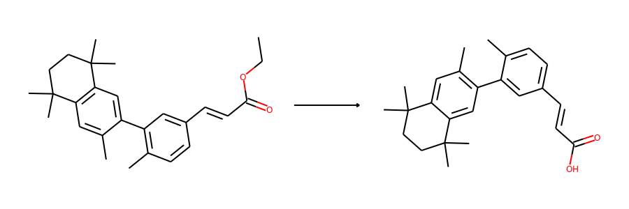
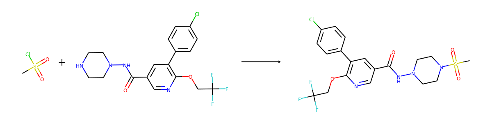
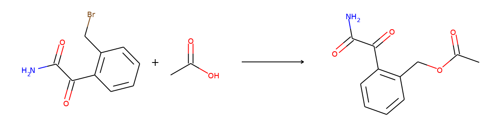
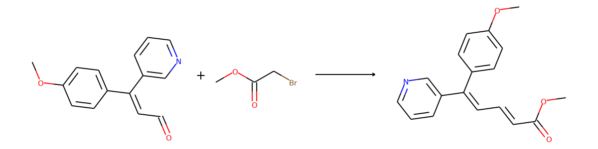